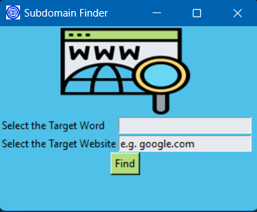

# Subdomain Finder

Subdomain Finder is a Python application that allows you to find subdomains of a target website by specifying a target word. It also checks if the website exists.

## Features

- **Subdomain Discovery**: Discover subdomains of a target website by providing a target word.

- **Website Validation**: Check if the website exists by making a request to the specified URL.

- **User-Friendly Interface**: The application provides a simple and user-friendly interface for entering target information.

## How to Use

1. Clone the project to your computer or download it as a zip file.

2. Make sure you have Python installed on your system.

3. Run the application by executing the `subdomain_finder.py` file.

4. Ensure you have the necessary Python libraries installed by running the following commands:
   
pip install requests pillow

5. Enter the target website's domain (e.g., "google.com") in the "Select the Target Website" field.

6. Enter a target word in the "Select the Target Word" field. This word will be used to discover subdomains.

7. Click the "Find" button to discover subdomains and validate the website's existence.

8. The discovered subdomain, if found, will be displayed in the "Discovered Subdomain" section.

9. You can click on the subdomain link to open it in your default web browser.

Screenshot

